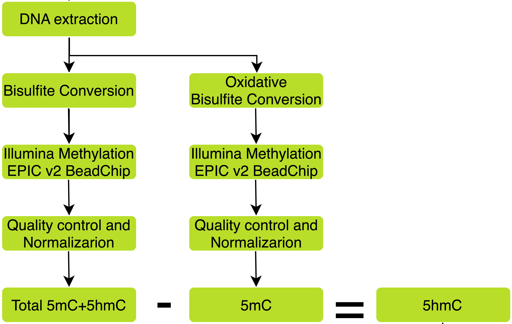

# HydroxymethylateR
R workflow for preprocessing, analyzing, and annotating Illumina HumanMethylationEPIC hydroxymethylation data.

## Computational Environment Requirements

Developed and tested on Linux. Other platforms (e.g., macOS, Windows) might also work.

### System Requirements

- A **Linux-based computer** (tested on Ubuntu)
- `R >= 4.5`
- `Bioconductor >= 3.2`
- `ChAMP >= 2.36`

---

## Overview

This workflow is built to:  
- Import and preprocess bisulfite (BS) and oxidative bisulfite (oxBS) array data.  
- Normalize data using NOOB/FunNorm/RAW and filter out problematic probes.  
- Estimate sex, cell type proportions and predict smoking status and age.  
- Run the MLML method to quantify hydroxymethylation (5hmC) levels.  

# `preprocess_hydroxymethylation_data()`

## Workflow Overview




## Function Signature

```r
preprocess_hydroxymethylation_data(
  ox_file, bs_file,
  annotation_array           = "IlluminaHumanMethylationEPICv2",
  annotation_version         = "20a1.hg38",
  normalization              = "NOOB",
  ChAMPfilter_arraytype_bs   = "EPICv2",
  ChAMPfilter_ProbeCutoff_bs = 0.01,
  ChAMPfilter_arraytype_ox   = "EPICv2",
  ChAMPfilter_ProbeCutoff_ox = 0.01,
  file_inaccuracies          = NULL,
  low_variance_threshold_hmc = 0,
  predictSex                 = FALSE,
  predictSmoking             = FALSE,
  predictAge                 = FALSE,
  calculateCellPropPCs       = FALSE,
  plotCellProps              = FALSE,
  plotPCA                    = FALSE,
  plotSVD                    = FALSE,
  plotHmC                    = FALSE,
  output_dir                 = getwd()
)
```

---

## Arguments & Options

| Argument                     | Type / Accepted values         | Default                            | Description                                     |
| ---------------------------- | ------------------------------ | ---------------------------------- | ----------------------------------------------- |
| `ox_file`                    | `character` (path)             | **required**                       | csv of metadata for OxBS arrays.                |
| `bs_file`                    | `character` (path)             | **required**                       | csv of metadata for BS arrays.                  |
| `annotation_array`           | Valid `minfi` array string     | `"IlluminaHumanMethylationEPICv2"` | Probe annotation.                               |
| `annotation_version`         | `character`                    | `"20a1.hg38"`                      | Annotation version.                             |
| `normalization`              | `"NOOB"`, `"FUNORM"`, `"RAW"`  | `"NOOB"`                           | Choose normalisation.                           |
| `ChAMPfilter_arraytype_bs`   | `"450K"`, `"EPIC"`, `"EPICv2"` | `"EPICv2"`                         | Array type for ChAMP filter (BS).               |
| `ChAMPfilter_ProbeCutoff_bs` | `numeric` 0-1                  | `0.01`                             | ProbeCutoff (BS).                               |
| `ChAMPfilter_arraytype_ox`   | As above                       | `"EPICv2"`                         | Array type for ChAMP filter (OxBS).             |
| `ChAMPfilter_ProbeCutoff_ox` | `numeric` 0–1                  | `0.01`                             | ProbeCutoff (OxBS).                             |
| `file_inaccuracies`          | `NULL` or path                 | `NULL`                             | Inaccurancies probes list (column **`IlmnID`**).|
| `low_variance_threshold_hmc` | `numeric ≥ 0`                  | `0`                                | Low variance threshold 5hmc                     |
| `predictSex`                 | `logical`                      | `FALSE`                            | Add sex prediction via `minfi::getSex()`.       |
| `predictSmoking`             | `logical`                      | `FALSE`                            | Add smoking score via **EpiSmokEr**.            |
| `predictAge`                 | `logical`                      | `FALSE`                            | Add DNAm age (Horvath) via **wateRmelon**.      |
| `calculateCellPropPCs`       | `logical`                      | `FALSE`                            | Estimate blood-cell composition-PCs.            |
| `plotCellProps`              | `logical`                      | `FALSE`                            | Save stacked-bar chart cell-composition plot    |
| `plotPCA`                    | `logical`                      | `FALSE`                            | Save PCA                                        |
| `plotSVD`                    | `logical`                      | `FALSE`                            | Save ChAMP SVD plots.                           |
| `plotHmC`                    | `logical`                      | `FALSE`                            | Save 5hmC density plot.                         |
| `output_dir`                 | `character` (path)             | `getwd()`                          | Destination folder for all outputs.             |

---

## Required Inputs

### 1. Metadata csv (`ox_file`, `bs_file`)

Each csv must contain **one row per array** and these **five columns** (case-sensitive):

| Column        | Description                                          | Example        |
| ------------- | ---------------------------------------------------- | -------------- |
| `Sample_Name` | Unique experiment ID (overwritten internally).       | `S01`          |
| `Array`       | Illumina barcode (last 10 digits of iDAT filenames). | `1234567890`   |
| `Slide`       | Illumina slide ID (first part of iDAT filenames).    | `204905210066` |
| `iDAT_PATH`   | Directory containing Red + Grn iDATs for that slide. | `/data/iDATs/` |
| `status`      | Custom label (`case`, `control`, etc.).              | `case`         |

> **Expected folder layout**
>
> ```
> iDAT_PATH/
> └── SLIDE/
>     ├── SLIDE_ARRAY_Red.iDAT
>     └── SLIDE_ARRAY_Grn.iDAT
> ```

### 2. Optional Probe Inaccuracies (`file_inaccuracies`)

Csv with a column **`IlmnID`** listing probes to exclude.

---

## Outputs

Everything is written to `output_dir` (default: working directory):

```
output_dir/
├── phenotype_table.csv        # per-sample metadata (+ optional sex, PCs, etc.)
├── filtered_hmC.csv           # long-format 5hmC after variance filtering
├── cell_props.png             # optional barplot of blood-cell composition
├── explained_variance.png     # optional PCA scree (BS)
├── Hydroxymethylation Density by Sample.png  # optional 5hmC densities
└── SVD_Plots/                 # created when plotSVD = TRUE
    ├── ChAMP.SVD.pdf
    └── ChAMP.SVD.Rdata
```

The function **returns** an invisible list:

* `phenotype_df_bs` – BS sample metadata
* `filtered_hmC` – long-format 5hmC

---

## Core Workflow (14 Steps)

1. Read and validate metadata
2. Read **OxBS** iDAT
3. Read **BS** iDAT
4. *(Optional)* predict sex
5. Normalise (NOOB / FunNorm / Raw)
6. **ChAMP filter** - BS
7. **ChAMP filter** - OxBS
8. Remove inaccuracies probes
9. Build phenotype dataframe for BS
10. *(Optional)* estimate cell proportions
11. *(Optional)* predict smoking score
12. *(Optional)* predict DNAm age (Horvath)
13. Estimate 5hmC via **MLML2R**
14. Low-variance filter & write outputs

Each step frees memory with `rm(); gc()`.

---

## Minimal Example

```r
library(HydroxymethylateR)

results <- preprocess_hydroxymethylation_data(
  ox_file    = "metadata_oxbs.csv",
  bs_file    = "metadata_bs.csv",
  output_dir = "results"
)

# Access outputs
head(results$phenotype_df_bs)
head(results$filtered_hmC)
```


## Required Packages

The following R packages (from CRAN and Bioconductor) are required:

### CRAN Packages:
- `viridis`, `ggplot2`, `reshape2`

### Bioconductor Packages:
- `FlowSorted.Blood.EPIC`, `sesame`, `wateRmelon`,`MLML2R`, `EpiSmokEr`, `minfi`, `ChAMP`
---

## Installation Instructions

To install this workflow:

```bash
devtools::intall_github("eirinisparaki/HydroxymethylateR")
```
---

Here's the Markdown text you can add to your `README.md` to cover both the citation of your tool and a reference to the citation list for dependencies:

---

### 📖 Citation

If you use **HydroxymethylateR** in your research, please cite:

* This GitHub repository: [eirinisparaki/HydroxymethylateR](https://github.com/eirinisparaki/HydroxymethylateR)

For citations of the R packages used in this project, please refer to [CITATIONS.md](CITATIONS.md).

---

## Contact

For questions or collaborations, feel free to contact:

**Eirini Sparaki**  
📧 sparakiirini@gmail.com  
🔗 [https://github.com/eirinisparaki](https://github.com/eirinisparaki)

